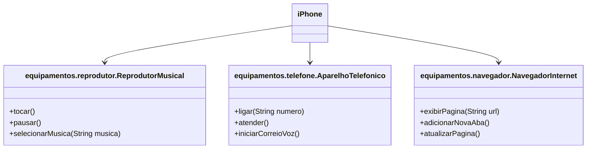

# POO - Desafio

### Modelagem e Diagramação de um Componente iPhone

Neste desafio, fui responsável por modelar e diagramar a representação UML do componente iPhone, abrangendo suas funcionalidades como equipamentos.reprodutor.Reprodutor Musical, Aparelho Telefônico e equipamentos.navegador.Navegador na Internet.

#### Contexto
Com base no vídeo de lançamento do iPhone de 2007 (link abaixo), elaborei a diagramação das classes e interfaces utilizando `Mermaid`. Em seguida, implementei as classes e interfaces no formato de arquivos `.java`.

[Lançamento iPhone 2007](https://www.youtube.com/watch?v=9ou608QQRq8)
- Minutos relevantes: 00:15 até 00:55

### Meu Diagrama UML (Mermaid)

